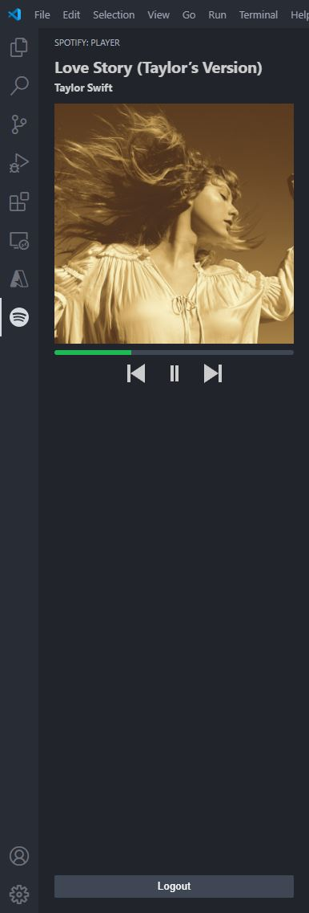

# Spotify Player

Control your Spotify music within VSCode.

## Features

Control your music

-   Pause/Play
-   Next/Prvious song
-   Seek to position in song
-   View album art



## Requirements

Install all dependencies.

```
npm install
```

Build the extension

```
npm run watch
```

Debug using F5 to run the extension.

## Known Issues

None
